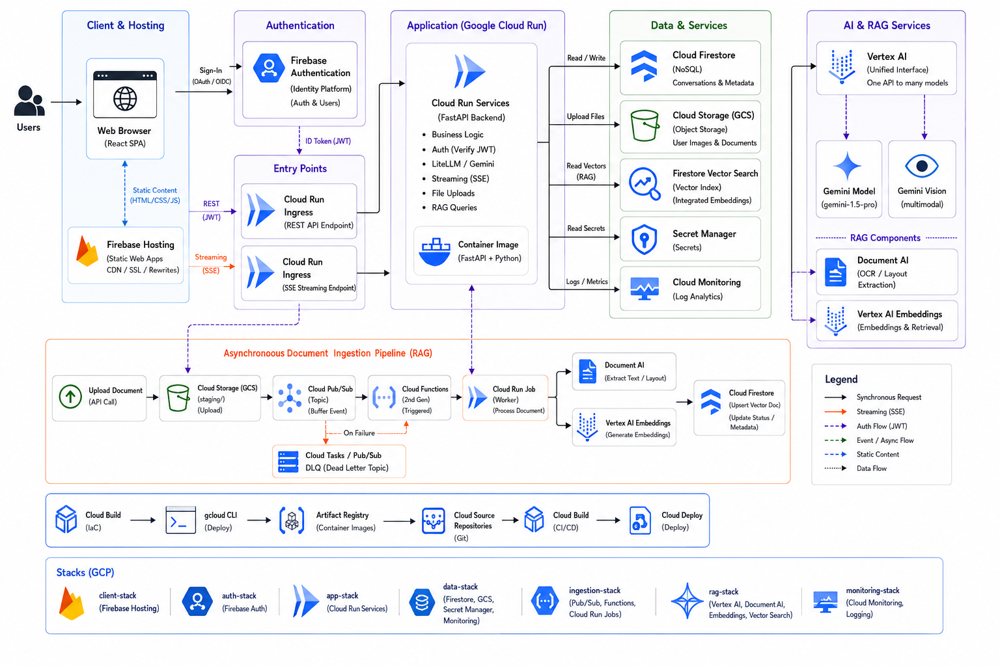
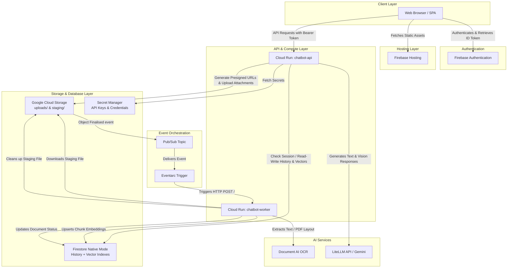
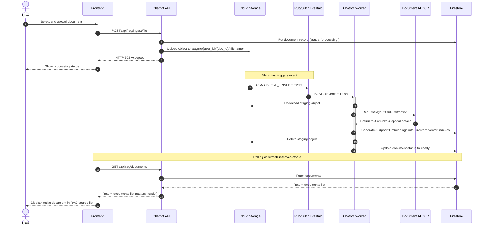
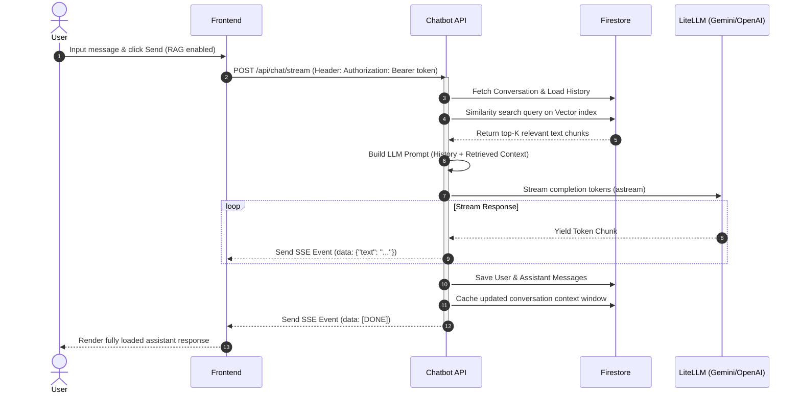

# Serverless Chatbot and RAG Platform on GCP

A production-grade, secure, and fully serverless AI Chatbot and RAG (Retrieval-Augmented Generation) platform. The application is built using a decoupled Python FastAPI backend and a TypeScript React SPA frontend, deployed natively on Google Cloud Platform (GCP).

The architecture features Server-Sent Events (SSE) streaming through Cloud Run, Firebase Authentication on the frontend and backend, private multimodal attachment storage in Google Cloud Storage, and a decoupled event-driven RAG ingestion pipeline using Pub/Sub, Eventarc, a private Cloud Run worker, Document AI, and native Firestore for conversation history and vector storage.

---

## Architecture Overview



The system is fully serverless, utilising Google Cloud Platform (GCP) services to achieve auto-scaling to zero and minimize operational overhead.

### High-Level Architecture Diagram



---

## Key Features

- **Decoupled Architecture:** Clean separation between static frontend, API endpoint backend, and asynchronous ingestion worker.
- **Serverless Ingestion Pipeline:** Uses Eventarc and Pub/Sub to trigger Document AI layout processing automatically when new files land in Cloud Storage.
- **Native Vector Search:** Utilises Firestore Native vector indexes, eliminating the need for a separate third-party vector database.
- **Real-Time Streaming:** Implements Server-Sent Events (SSE) via FastAPI and HTTP streaming to provide instantaneous chat replies.
- **Secure File Attachments:** Direct uploads to private Google Cloud Storage buckets, secured using transient signed URLs for authorized retrieval.
- **Multi-Model Support:** Configured via LiteLLM to interface natively with Gemini, OpenAI, or other providers, utilizing secrets from Secret Manager.
- **Robust Error Handling:** Distinguishes between transient/network errors and terminal validation issues to handle retries properly in Pub/Sub.

---

## Tech Stack

| Component           | Technology                                      | Description                                                |
| :------------------ | :---------------------------------------------- | :--------------------------------------------------------- |
| **Frontend**        | React (v19), TypeScript, TailwindCSS (v4), Vite | Modern single-page application (SPA)                       |
| **Backend**         | Python, FastAPI, Uvicorn, Pydantic              | Decoupled asynchronous web framework                       |
| **Vector DB**       | Firestore Native Mode                           | Stores conversation state, messages, and vector embeddings |
| **File Storage**    | Google Cloud Storage (GCS)                      | Secure document and attachment staging/storage             |
| **Auth**            | Firebase Authentication                         | Decodes and validates JWT tokens on backend endpoints      |
| **Async Tasks**     | Pub/Sub, Eventarc, Cloud Run Worker             | Zero-polling ingestion pipeline                            |
| **AI/OCR**          | Google Cloud Document AI, LiteLLM               | Advanced OCR extraction and LLM routing                    |
| **Package Manager** | `uv` (Backend), `pnpm` (Frontend)               | Ultra-fast dependency management tools                     |
| **Infrastructure**  | Terraform                                       | Infrastructure as Code (IaC) configuration                 |

---

## Project Structure

```txt
chatbot-gcp/
├── gcp-infra/              # Terraform Infrastructure as Code (IaC)
│   ├── main.tf             # Core IaC orchestrator
│   ├── variables.tf        # Input variable declarations
│   └── modules/            # Component modules (Storage, Firestore, Run, Ingestion, Secrets)
├── backend/                # Python FastAPI Backend
│   ├── app/
│   │   ├── main.py         # Chatbot API application entrypoint
│   │   ├── worker.py       # Cloud Run worker event application entrypoint
│   │   ├── dependencies.py # Dependency injection providers (LLM, DB, GCS)
│   │   ├── settings.py     # Pydantic Settings configuration
│   │   ├── services/       # Core business logic (RAG, Storage, LLM, Vector)
│   │   └── repositories/   # Persistence layer (Firestore ConversationRepository)
│   ├── Dockerfile          # Dockerfile for main API container
│   ├── Dockerfile.worker   # Dockerfile for Ingestion Worker container
│   ├── pyproject.toml      # Dependency & project configurations
│   └── tests/              # Pytest integration tests
├── frontend/               # TypeScript Vite React SPA
│   ├── src/
│   │   ├── App.tsx         # Core app layout, state & interface
│   │   ├── main.tsx        # React mounting entrypoint
│   │   ├── services/       # Firebase Client & custom API integrations
│   │   └── types/          # Shared TypeScript type definitions
│   ├── firebase.json       # Firebase Hosting routing declarations
│   └── package.json        # Dependencies list
├── Makefile                # Multi-command developer orchestration
├── deploy-backend.sh       # Script to build and push FastAPI API container
├── deploy-worker.sh        # Script to build and push Ingestion Worker container
└── deploy-frontend.sh      # Script to build and publish static bundle to Hosting
```

---

## Logic Flows

### Asynchronous RAG Ingestion Pipeline



### Chat Request & Real-time SSE Streaming Flow



---

## Installation & Setup

### Prerequisite Setup

Ensure the following tools are installed on your environment:

- Install [uv](https://github.com/astral-sh/uv) (Python packaging tool).
- Install [pnpm](https://pnpm.io/) (Node package manager).
- Install [Firebase CLI](https://firebase.google.com/docs/cli).
- Log into Google Cloud SDK (`gcloud auth login` and `gcloud auth application-default login`).

### 1. Configuration Setup

Copy the example environment configuration file to create your local variables:

```bash
cp .env.example .env
```

Ensure all variables inside `.env` are configured correctly (e.g. `GCP_PROJECT_ID`, `FIREBASE_PROJECT_ID`, `LITELLM_API_KEY`).

### 2. Run the Backend Locally

```bash
cd backend
uv sync
uv run uvicorn app.main:app --port 8080 --reload
```

### 3. Run the Frontend Locally

```bash
cd frontend
pnpm install
pnpm dev
```

The frontend application will be hosted locally at `http://localhost:5173`.

### 4. Running Tests

```bash
cd backend
uv run pytest
```

---

## Usage Examples

Below are standard API integration patterns using `curl`. Replace `$ID_TOKEN` with a valid Firebase ID Token.

### 1. Send Chat Request (Synchronous API)

```bash
curl -X POST "http://localhost:8080/api/chat" \
     -H "Authorization: Bearer $ID_TOKEN" \
     -H "Content-Type: application/json" \
     -d '{
       "message": "What is the ingestion pipeline structure?",
       "use_rag": true,
       "conversation_id": "optional-custom-conversation-uuid"
     }'
```

### 2. Stream Chat Completion (Server-Sent Events)

```bash
curl -N -X POST "http://localhost:8080/api/chat/stream" \
     -H "Authorization: Bearer $ID_TOKEN" \
     -H "Content-Type: application/json" \
     -d '{
       "message": "Explain Server-Sent Events",
       "use_rag": false
     }'
```

### 3. Ingest Plain Text Document into RAG Database

```bash
curl -X POST "http://localhost:8080/api/rag/ingest" \
     -H "Authorization: Bearer $ID_TOKEN" \
     -H "Content-Type: application/json" \
     -d '{
       "filename": "pipeline_doc.txt",
       "content": "This document contains data about serverless workflows on GCP."
     }'
```

### 4. Ingest PDF / Binary Document

```bash
curl -X POST "http://localhost:8080/api/rag/ingest/file" \
     -H "Authorization: Bearer $ID_TOKEN" \
     -F "file=@/path/to/document.pdf"
```

### 5. Fetch Conversation History

```bash
curl -X GET "http://localhost:8080/api/conversations" \
     -H "Authorization: Bearer $ID_TOKEN"
```
